# ABC Learning Platform

ABC Learning Platform is an innovative and interactive e-learning solution designed to empower students and professionals to achieve their career goals. Inspired by platforms like Udemy, ABC Learning goes beyond traditional learning with a rich ecosystem of features for education, collaboration, and career development. Built using React, Laravel, MySQL, and powered by **FFmpeg for video encryption**, it ensures a secure and seamless learning experience.

---

## Key Features

### For Students
- **Course Subscription**: Explore and subscribe to courses tailored to your interests.
- **Learning and Assessment**:
  - Engage in lessons through video content.
  - Complete tests, assessments, and mini-projects.
  - Use the **inbuilt code editor** for hands-on projects.
  - EBooks for reading materials.
- **Certificate Generation**: Earn certificates upon successful course completion.
- **Interactive Learning Tools**:
  - Participate in Q&A sessions with trainers.
  - Save notes directly within the platform.
  - Discuss topics and get peer support through **forums** (with voting for top answers).
- **Internships & Jobs**:
  - Apply for internships with task submissions using the inbuilt code editor.
  - Apply for jobs posted by trainers after clearing a preliminary test.

### For Admins
- **Complete Control**:
  - Add and manage courses, assessments, trainers, and more.
  - Monitor platform activities including course enrollments, Q&As, and forum discussions.
  - Generate insights for better platform performance.

### For Trainers
- **Content Management**:
  - Create and manage your courses.
  - Interact with students through Q&A and discussions.
  - Track enrolled students’ progress and engagement.

### For Recruiters
- **Job Posting**:
  - Post job openings for students.
  - Review and shortlist candidates who pass the preliminary tests.

---

## Technologies Used

- **Frontend**: React.js
- **Backend**: Laravel
- **Database**: MySQL
- **Video Encryption**: FFmpeg

---

## Screenshots

### Student Features
1. **Dashboard**: Overview of enrolled courses, progress, and certifications.
2. **Course Page**: Video lessons, assessments, and forums.
3. **Code Editor**: Built-in IDE for tasks and mini-projects.

### Admin Features
1. **Course Management**: Add, edit, or delete courses and associated details.
2. **Monitoring**: Dashboard showing platform metrics.

### Trainer Features
1. **Student Management**: Track and evaluate student progress.
2. **Q&A Management**: Interact with students and address their queries.

### Recruiter Features
1. **Job Posting**: Interface to post and manage job opportunities.
2. **Candidate Evaluation**: Review student profiles and test submissions.

---
## Screenshots
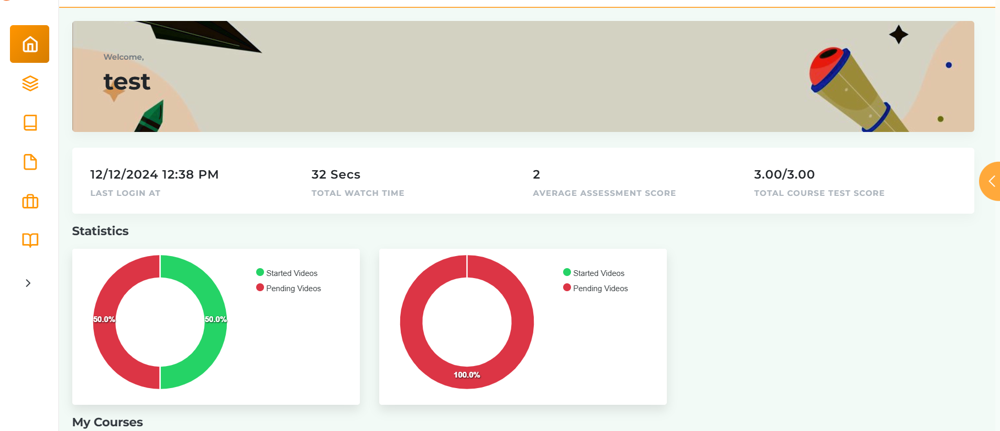
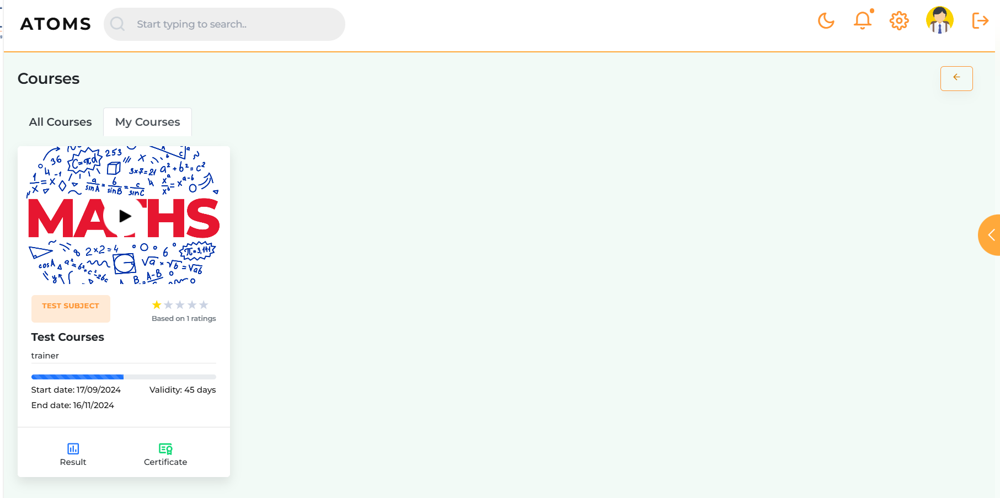
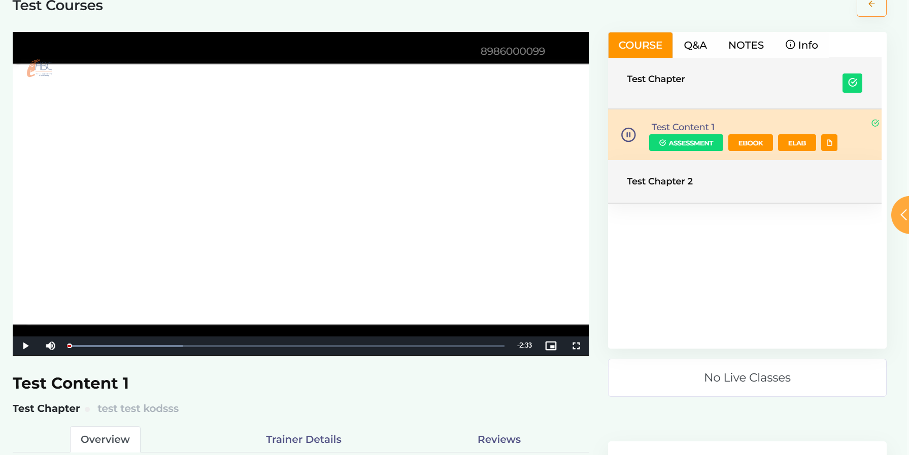
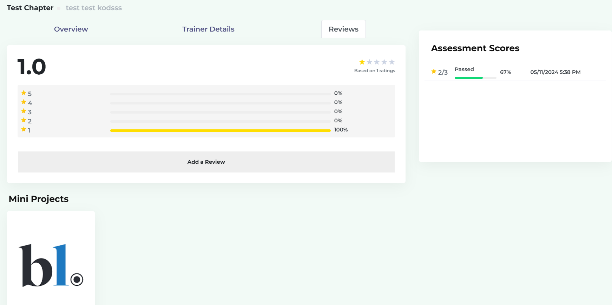
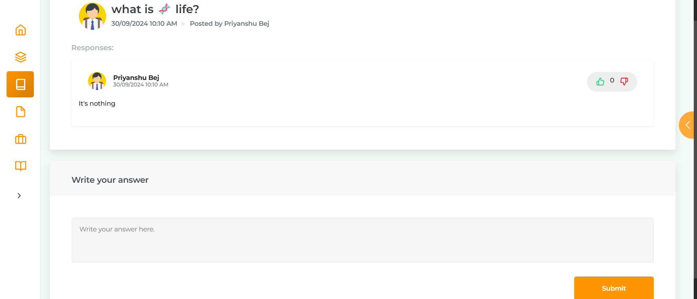
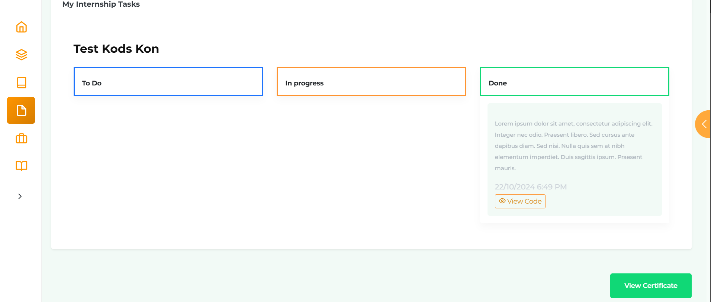
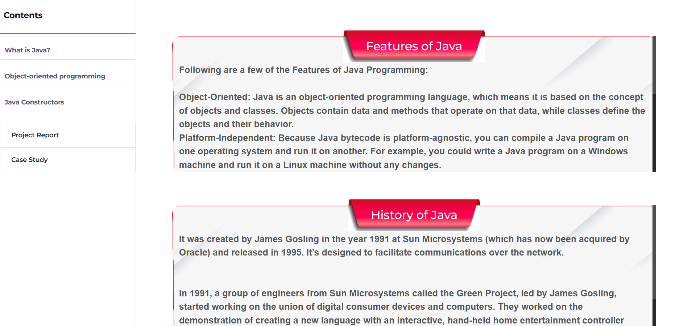
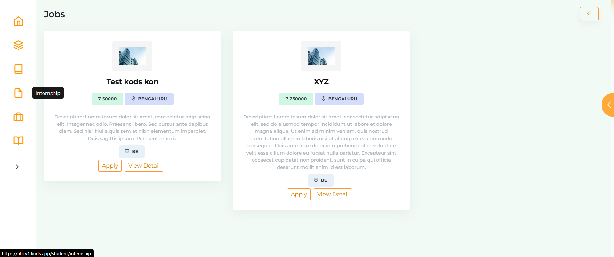
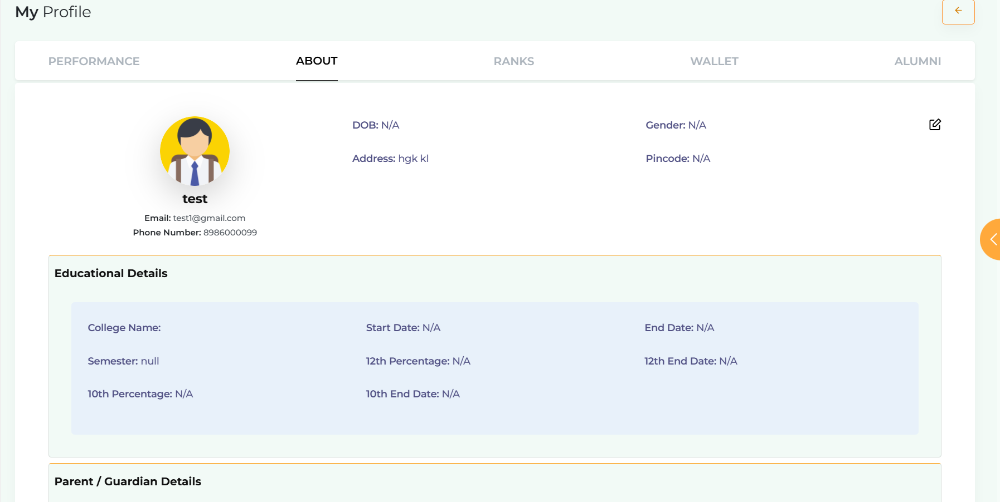
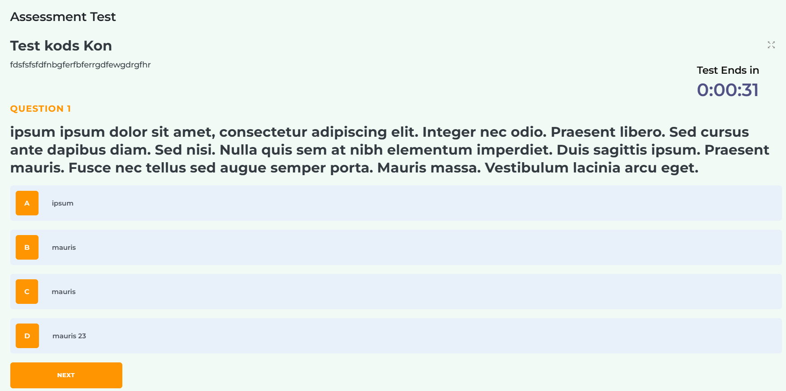
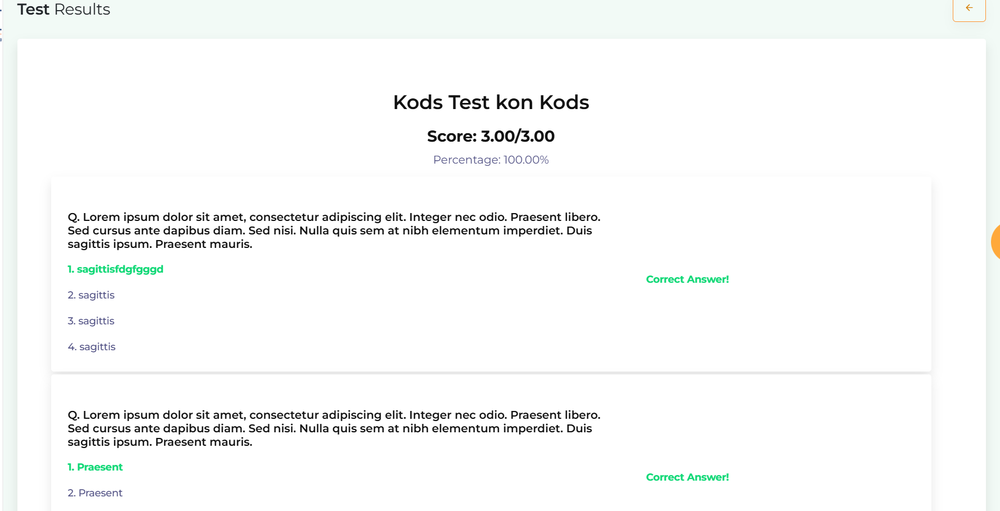
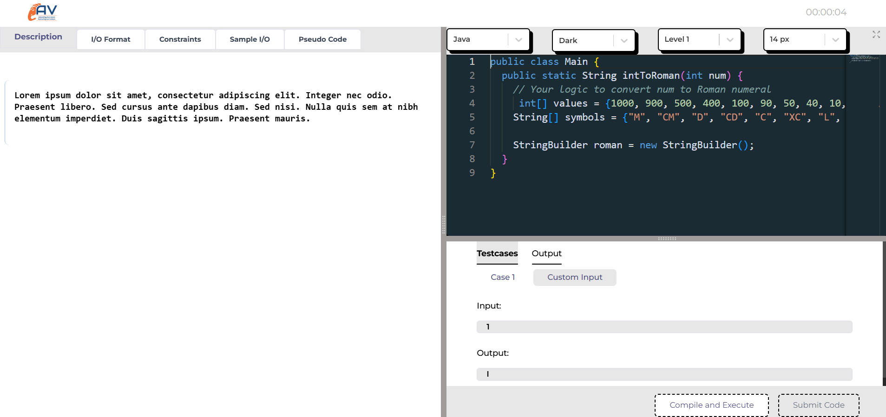

## Future Enhancements
- **Gamification**: Add badges and leaderboards to motivate students.
- **AI Recommendations**: Personalized course suggestions for students.
- **Live Classes**: Real-time interactive sessions with trainers.
- **Advanced Analytics**: Insights for trainers and recruiters to enhance decision-making.

---
